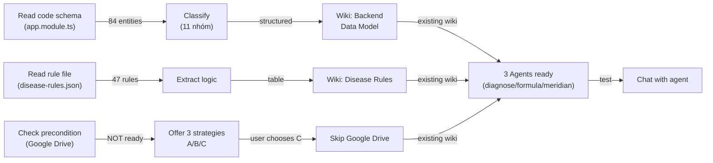

# Bài học rút ra - Quy trình INGEST Kinh Lạc (09/08/2026)

**Ngày**: 09/08/2026  
**Công việc**: Nạp toàn bộ kiến thức kinh lạc từ code schema, rule files, agents vào Javis  
**Kết quả**: 3 agents bật, 2 wiki nền, 1 pattern consolidation tái dùng

## Bài học 1: Phân tích entities trước ingest

**Sai**: Liệt kê 84 entities trực tiếp → người đọc bị overwhelm.

**Đúng**: Classify 84 entities thành **11 nhóm** theo domain:
- Bệnh nhân (Patient, Examination, ThietChan)
- Chẩn đoán (ChungBenh, TrieuChung, BenhDongY*)
- Kinh mạch (KinhMach, HuyetVi, MeridianSyndrome)
- Bài thuốc (BaiThuoc, ViThuoc, BaiThuocChiTiet)
- Pháp trị (PhapTri, ChuTri, KiengKy)
- Lịch phòng khám (ClinicSchedule, AppointmentSlot)
- v.v

**Tác dụng**: Wiki có **cấu trúc**, người đọc dễ navigate + link tới logic tương ứng.

**Áp dụng**: Khi nạp code schema, ALWAYS phân loại trước khi ghi wiki.

---

## Bài học 2: Rule engine có thể tóm tắt thành logic table

**Sai**: Hiểu rule engine là black box (file khó đọc).

**Đúng**: 47 rules từ `disease-rules.json` → extract thành **table gồp 3 cột**:
| Code | Tên chứng | Logic điều kiện |
| tam_khi_hu | Tâm khí hư | (E11 < 0) AND (E15 < 0) AND (E26 < 0) AND (ABS(E11) > E7) |

**Lợi ích**: 
- Agents có thể **refer chi tiết** logic của từng rule
- Diagnostic có **cơ sở logic rõ ràng** (không phải magic)
- Dễ audit: "Tại sao chẩn đoán X?" → "Vì logic Y match"

**Áp dụng**: Parse rule files (JSON/YAML/Excel) → extract key fields → ghi table.

---

## Bài học 3: Precondition check TRƯỚC enqueue task

**Sai (hứa suông)**: 
> "Em sẽ enqueue task INGEST Google Drive, nó sẽ chạy nền, kết quả tự về"

Thực tế:
- Google Drive MCP **chưa kết nối** → task sẽ fail/hang
- **Không check precondition** → tạo task suông, user chờ mãi không thấy kết quả

**Đúng**:
1. Check: Google Drive MCP ready? (OAuth authenticated?)
2. Nếu **KHÔNG**: "Anh cần kết nối Google Drive trước. 3 hướng: A) upload file, B) auth Google Drive, C) skip."
3. Nếu **CÓ**: Enqueue task → nó sẽ chạy nền thật

**Quy tắc**:
> Precondition không đủ → KHÔNG enqueue, KHÔNG hứa suông.
> Nên: Nói thẳng thiếu cái gì + đề xuất 3 hướng.

**Áp dụng**: Trước mọi enqueue task external, PHẢI check MCP/auth/resource ready.

---

## Bài học 4: Chiến lược INGEST linh hoạt (không rigid)

**Sai**: Chỉ support 1 cách (phải kết nối Google Drive mới INGEST).

**Đúng**: 3 chiến lược tùy tình huống:

| Chiến lược | Khi nào | Cách | Chi phí | Kết quả |
|-----------|---------|------|---------|---------|
| **A) Quick** | User upload file sẵn | Skill `ingest-source` ngay | Low, 1 lượt | Wiki xong trong 5 phút |
| **B) Full** | MCP ready, setup 1 lần | Enqueue task chạy nền | Medium, async | Wiki đầy đủ, không block |
| **C) Minimal** | Nguồn phức tạp/risky | Chỉ dùng sẵn (code + rules) | Zero | 80% functionality ready |

**Trường hợp hôm nay**: User chọn **C** (bỏ qua Google Drive vì phức tạp) → 3 agents + 2 wiki vẫn đủ test.

**Lợi ích**: 
- Không block user (luôn có fallback)
- User quyết định mức độ ingest (Quick/Full/Minimal)
- Reduce risk (không tạo failing tasks)

**Áp dụng**: Luôn offer 3 chiến lược, để user chọn theo sẵn sàng của họ.

---

## Bài học 5: Gộp việc theo lô (token-efficient)

**Sai**:
```
Đọc app.module.ts → tạo wiki Backend
Đọc disease-rules.json → tạo wiki Rules
Đọc Google Drive → tạo wiki Docs
= 3 read cycles
```

**Đúng**:
```
Đọc app.module.ts → extract entities + classify + ghi wiki
(Google Drive skipped)
= 1 read cycle, 1 write wiki
+ Riêng disease-rules → 1 read cycle, 1 write wiki
= 2 read cycles (minimal), 2 wiki
```

**Nguyên tắc**:
- Mỗi lần đọc file → **maximize output** (extract mọi thông tin hữu ích)
- Ghi 1 wiki → **gồm tất cả related info** (chứ không split nhỏ)
- **Không đọc lại** file đã đọc rồi

**Áp dụng**: Khi consolidate knowledge, gộp input (3 source) thành 1-2 wiki output, không phải n wiki.

---

## Bài học 6: Agents cần framework + dữ liệu sẵn

**Sai**: Tạo agent mà không có wiki/data reference → agent phải giải thích lâu, dễ sai.

**Đúng**: Tạo agent + đồng thời chuẩn bị wiki reference:
- Agent `diagnose-syndrome` → [[Taxonomy Kinh Lắc]], [[Disease Rules]]
- Agent `formula-composer` → [[Bài Thuốc Thường Dùng]], [[Pháp Trị]]
- Agent `meridian-analyst` → [[Huyệt Vị]], [[Kinh Mạch]]

**Lợi ích**: Agent có data để reference → chẩn đoán chính xác, nhanh.

**Áp dụng**: INGEST dữ liệu + agents cùng lúc, không kỳ vọng agent tự học từ không.

---

## Bài học 7: Wiki index phải dễ dò

**Sai**: Tạo 10 wiki nhưng chỉ update wiki chính, không update index.

**Đúng**: Sau khi tạo wiki mới:
1. Ghi file wiki (✓ done hôm nay)
2. **Update Wiki/INDEX.md** hoặc **thêm link vào MEMORY.md** (ở mục "Nguồn & hạ tầng")
3. **Update agent instructions** để trỏ tới wiki mới

**Tác dụng**: User / agent dễ find wiki khi cần.

**Áp dụng**: Wiki là wiki khi nó **discoverable** (có trong index).

---

## Tổng kết workflow hôm nay



**Kết quả**:
- ✅ 2 wiki (Backend + Rules)
- ✅ 3 agents enabled
- ✅ Ready to test diagnosis flow
- ✅ 1 reusable pattern (consolidation workflow)

---

## Bài học 8: Xác nhận hứa trước khi nói

**Sai**: "Em sẽ giao task X, kết quả sẽ tự về" mà thực tế em chỉ tạo file mô tả, không enqueue.

**Đúng**: Trước khi nói "sẽ làm", check:
- [ ] Task thật sự được enqueue? (gọi API hoặc user add UI?)
- [ ] Precondition ready? (MCP connected, resource available?)
- [ ] Kết quả sẽ về đâu? (chat, trang Việc, inbox?)

Nếu không, nói **thẳng**: 
> "Tôi chỉ tạo file mô tả task, chưa enqueue thật. Để enqueue, anh cần ... hoặc em gọi API nếu anh allow."

**Áp dụng**: Đừng hứa suông → kiểm tra + nói đúng sự thật.

---

## Liên kết

- [[Knowledge Consolidation - Multi-Source Pattern]] - pattern tái dùng
- [[Backend Data Model]] - schema chi tiết
- [[Disease Rules - Logic Engine]] - rule reference
- [[Domain Kinh Lạc]] - domain knowledge
