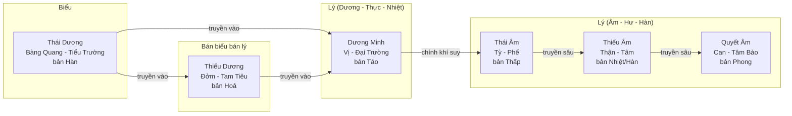

# Lục Kinh Thương Hàn

Sáu giai đoạn truyền biến của ngoại tà theo học thuyết Thương Hàn Luận (Trương Trọng
Cảnh): Thái Dương, Dương Minh, Thiếu Dương, Thái Âm, Thiếu Âm, Quyết Âm. Đây là một
trong ba khung định vị mà app dùng song song với Vệ - Khí - Dinh - Huyết (Ôn bệnh) và
Tam tiêu / Tạp bệnh - xem mục 6 của [[Bát Cương và Đồ Hình Thái Cực]]. Khung này **chỉ
áp dụng cho thể bệnh đo ra được từ kinh lạc**, không gán cho mọi ca; chi tiết điều kiện
áp dụng ở [[thuong-han-chi-ap-cho-the-do-ra]].

Quy ước thuật ngữ dùng trong trang này tuân theo [[Taxonomy Kinh Lắc]] và
[[Chuẩn Hoá Thể Bệnh và Ánh Xạ YHCT - YHHĐ]]: viết **"Đởm"**, không viết "Đảm"
([[thong-nhat-dam-thanh-doi]]).

## 1. Trục Biểu - Bán biểu bán lý - Lý

Lục Kinh không phải sáu nhãn rời mà xếp theo một trục tiến triển từ nông vào sâu, từ
Dương sang Âm:

```
Biểu ────────────► Bán biểu bán lý ────────────► Lý
Thái Dương   Dương Minh                    Thái Âm
                  Thiếu Dương              Thiếu Âm
                                            Quyết Âm
```

- **Biểu**: tà khí còn ở phần ngoài (bì mao, cơ biểu) - Thái Dương.
- **Bán biểu bán lý**: tà khí đã vào nhưng chưa hẳn ở lý, giằng co giữa chính khí và tà
  khí - Thiếu Dương (Dương Minh thường được xếp là "Lý nhiệt thực" của phần Dương, đứng
  giữa Biểu và Bán biểu bán lý về mặt truyền kinh nhưng đã thuộc phần Lý về bệnh cơ).
- **Lý**: tà khí đã vào sâu, tạng phủ Âm bị tổn thương - Thái Âm, Thiếu Âm, Quyết Âm.

Ba kinh Dương (Thái Dương, Dương Minh, Thiếu Dương) ứng với giai đoạn chính khí còn
đủ sức chống tà, bệnh còn thuộc Thực - Nhiệt là chủ yếu. Ba kinh Âm (Thái Âm, Thiếu Âm,
Quyết Âm) ứng với giai đoạn chính khí đã suy, bệnh nghiêng về Hư - Hàn. Đây chính là chỗ
nối với cặp Hàn - Nhiệt và Hư - Thực của Bát Cương.

## 2. Sáu kinh

### 2.1 Thái Dương

- **Bản khí**: Hàn (Thái Dương bản Hàn, tiêu Dương - hàn hoá).
- **Phủ - tạng tương ứng**: Bàng Quang (phủ), phối hợp Tiểu Trường; kinh Bàng Quang và
  kinh Tiểu Trường thuộc Thái Dương.
- **Chứng trạng đặc trưng**: sợ lạnh (ố hàn), phát sốt, đau đầu, gáy cứng (cứng gáy),
  mạch Phù. Nếu có mồ hôi và mạch Phù Hoãn là biểu hư (Quế Chi Thang chứng); không mồ
  hôi, mạch Phù Khẩn, suyễn là biểu thực (Ma Hoàng Thang chứng).
- **Giai đoạn theo trục Biểu - Lý**: Biểu - giai đoạn khởi phát, tà khí còn ở bì mao,
  cơ biểu.
- **Tầng bệnh Vệ - Khí - Dinh - Huyết**: tương ứng tầng **Vệ** - tà khí mới phạm vào
  phần bảo vệ ngoài cùng, chính khí (Vệ khí) giao tranh với tà khí gây sốt, sợ lạnh.
- **Pháp trị / liệu pháp**: giải biểu. Biểu hư dùng pháp giải cơ, điều hoà dinh vệ
  (Quế Chi Thang); biểu thực dùng pháp phát hãn, tuyên phế bình suyễn (Ma Hoàng Thang).
  Về châm cứu: tuyên thông biểu khí, sơ phong tán hàn, thường lấy huyệt Phong Trì, Đại
  Chuỳ, Hợp Cốc, Liệt Khuyết.

### 2.2 Dương Minh

- **Bản khí**: Nhiệt (Dương Minh bản Táo, tiêu Dương - táo hoá, khi hoá nhiệt thành
  Nhiệt Táo).
- **Phủ - tạng tương ứng**: Vị (phủ - kinh Túc Dương Minh Vị) và Đại Trường (phủ - kinh
  Thủ Dương Minh Đại Trường).
- **Chứng trạng đặc trưng**: sốt cao không sợ lạnh mà sợ nóng (ố nhiệt), mồ hôi ra
  nhiều, khát nước, mạch Hồng Đại (Dương Minh kinh chứng - Nhiệt ở khí phận, chưa
  kết); nếu tà nhiệt kết với táo trong ruột thì thêm bụng đầy cứng đau, táo bón, nói
  sảng, mạch Trầm Thực (Dương Minh phủ chứng - Nhiệt kết Lý thực).
- **Giai đoạn theo trục Biểu - Lý**: Lý nhiệt thực - tà khí đã vào Lý nhưng chính khí
  vẫn thịnh, giao tranh mạnh mẽ nhất trong sáu kinh, biểu hiện Nhiệt Thực điển hình.
- **Tầng bệnh Vệ - Khí - Dinh - Huyết**: tương ứng tầng **Khí** - tà nhiệt đã rời phần
  Vệ, vào sâu tới Khí phận, sốt cao, khát, mồ hôi nhiều là dấu hiệu Khí phận nhiệt
  thịnh điển hình.
- **Pháp trị / liệu pháp**: kinh chứng dùng pháp thanh nhiệt sinh tân (Bạch Hổ Thang);
  phủ chứng dùng pháp tả hạ nhiệt kết (Thừa Khí Thang các loại). Châm cứu thanh tả
  Dương Minh nhiệt, thường lấy Hợp Cốc, Nội Đình, Khúc Trì, Thiên Xu.

### 2.3 Thiếu Dương

- **Bản khí**: Hoả (Thiếu Dương bản Hoả, tiêu Dương - hoả hoá; còn gọi Tướng Hoả).
- **Phủ - tạng tương ứng**: Đởm (phủ - kinh Túc Thiếu Dương Đởm), phối hợp Tam Tiêu
  (kinh Thủ Thiếu Dương Tam Tiêu).
- **Chứng trạng đặc trưng**: hàn nhiệt vãng lai (lúc sốt lúc rét xen kẽ), ngực sườn
  đầy tức khó chịu, không muốn ăn uống, tâm phiền hay nôn, miệng đắng, họng khô, hoa
  mắt, mạch Huyền. Đây là "chứng bán biểu bán lý" kinh điển.
- **Giai đoạn theo trục Biểu - Lý**: Bán biểu bán lý - tà khí ở khoảng giữa Biểu và
  Lý, chính khí và tà khí giằng co không phân thắng bại nên hàn nhiệt vãng lai.
- **Tầng bệnh Vệ - Khí - Dinh - Huyết**: bắc cầu giữa **Vệ** và **Khí** - trạng thái
  giằng co ở bán biểu bán lý phản ánh tà khí đang dao động giữa hai tầng nông, chưa
  ổn định hẳn ở tầng nào.
- **Pháp trị / liệu pháp**: hoà giải Thiếu Dương (Tiểu Sài Hồ Thang) - không phát hãn,
  không công hạ, không thổ, chỉ hoà giải. Châm cứu sơ tiết Thiếu Dương, hoà giải biểu
  lý, thường lấy Ngoại Quan, Túc Lâm Khấp, Chi Câu, Dương Lăng Tuyền.

### 2.4 Thái Âm

- **Bản khí**: Thấp (Thái Âm bản Thấp, tiêu Âm - thấp hoá).
- **Phủ - tạng tương ứng**: Tỳ (tạng - kinh Túc Thái Âm Tỳ), phối hợp Phế (kinh Thủ
  Thái Âm Phế).
- **Chứng trạng đặc trưng**: bụng đầy trướng, nôn, ăn không tiêu, đại tiện lỏng (tự
  lợi ích thậm), thỉnh thoảng đau bụng, tay chân không ấm, không khát, mạch Trầm Hoãn
  hoặc Trầm Nhược. Là kinh Âm đầu tiên, đánh dấu chính khí bắt đầu suy, Tỳ Dương hư
  hàn, vận hoá thất thường.
- **Giai đoạn theo trục Biểu - Lý**: Lý hư hàn (thuộc Âm) - tà khí đã vào Lý, chính khí
  đã suy, bệnh cơ chuyển từ Thực sang Hư, từ Nhiệt sang Hàn.
- **Tầng bệnh Vệ - Khí - Dinh - Huyết**: tương ứng phần sâu của **Khí** phận nghiêng
  Hư Hàn - khác với Dương Minh (Khí phận Thực Nhiệt), Thái Âm là Khí phận đã hư suy,
  không đủ sức hoá nhiệt.
- **Pháp trị / liệu pháp**: ôn trung kiện Tỳ, táo thấp (Lý Trung Thang, Tứ Nghịch
  Thang gia giảm). Châm cứu ôn bổ Tỳ Dương, kiện vận hoá thấp, thường lấy Túc Tam Lý,
  Tỳ Du, Trung Quản, Âm Lăng Tuyền, có thể phối cứu (rạo ấm).

### 2.5 Thiếu Âm

- **Bản khí**: Nhiệt trên nền Quân Hoả kết hợp Hàn thuỷ - Thiếu Âm là kinh duy nhất
  gồm cả thuỷ (Thận) và hoả (Tâm) nên có thể hoá Hàn (Thiếu Âm Hàn hoá) hoặc hoá Nhiệt
  (Thiếu Âm Nhiệt hoá) tuỳ thể trạng.
- **Phủ - tạng tương ứng**: Thận (tạng - kinh Túc Thiếu Âm Thận), phối hợp Tâm (kinh
  Thủ Thiếu Âm Tâm).
- **Chứng trạng đặc trưng**: mạch Vi Tế, chỉ muốn ngủ (mạch vi tế, đãn dục mị) - đây
  là đề cương của cả kinh. Thể hàn hoá: sợ lạnh, tay chân quyết lạnh, đại tiện lỏng,
  tinh thần lơ mơ. Thể nhiệt hoá: tâm phiền không ngủ được, miệng khô họng đau, lòng
  bàn tay bàn chân nóng, lưỡi đỏ ít rêu.
- **Giai đoạn theo trục Biểu - Lý**: Lý - giai đoạn nguy kịch, bệnh đã phạm tới gốc
  Tiên Thiên (Thận), chính khí suy kiệt rõ rệt.
- **Tầng bệnh Vệ - Khí - Dinh - Huyết**: tương ứng tầng **Dinh** - tà khí vào sâu tới
  phần Dinh (Tâm chủ Huyết Dinh), biểu hiện tâm phiền, mất ngủ, chất lưỡi đỏ là dấu
  hiệu nhiệt nhiễu Dinh phận; thể hàn hoá là Dinh khí không được Tâm Thận Dương ôn ấm.
- **Pháp trị / liệu pháp**: thể hàn hoá dùng pháp hồi dương cứu nghịch (Tứ Nghịch
  Thang); thể nhiệt hoá dùng pháp tư âm thanh nhiệt, giao thông Tâm Thận (Hoàng Liên
  A Giao Thang). Châm cứu ôn bổ Thận Dương hoặc tư bổ Thận Âm giao thông Tâm Thận,
  thường lấy Thái Khê, Thần Môn, Quan Nguyên, Túc Tam Lý (có thể phối cứu ở thể hàn).

### 2.6 Quyết Âm

- **Bản khí**: Phong (Quyết Âm bản Phong, tiêu Âm; kinh có tính chất hàn nhiệt thác
  tạp rõ nhất vì nằm ở cửa cuối cùng, chỗ Âm cực sinh Dương).
- **Phủ - tạng tương ứng**: Can (tạng - kinh Túc Quyết Âm Can), phối hợp Tâm Bào Lạc
  (kinh Thủ Quyết Âm Tâm Bào).
- **Chứng trạng đặc trưng**: khí thượng xung vào Tâm, Tâm trung nghi nhiệt đau, đói mà
  không muốn ăn, ăn vào thổ ra cả giun (thổ hồi), tay chân quyết lạnh xen kẽ phát nhiệt
  (quyết nhiệt thắng phục) - đặc trưng hàn nhiệt thác tạp, thượng nhiệt hạ hàn.
- **Giai đoạn theo trục Biểu - Lý**: Lý - giai đoạn cuối cùng của truyền biến Lục Kinh,
  bệnh cơ giằng co giữa còn sống (Dương phục) và nguy kịch (quyết nghịch), là ranh giới
  quyết định tiên lượng.
- **Tầng bệnh Vệ - Khí - Dinh - Huyết**: tương ứng tầng **Huyết** - giai đoạn sâu nhất,
  động phong, chảy máu, hôn mê là biểu hiện Huyết phận bị nhiễu loạn; đồng thời phản
  ánh cơ chế "Âm cực sinh Dương" khi chính khí còn khả năng hồi phục.
- **Pháp trị / liệu pháp**: pháp ôn tạng an hồi (Ô Mai Hoàn) khi có thổ hồi; pháp thanh
  thượng ôn hạ khi thượng nhiệt hạ hàn rõ rệt; khi quyết nghịch nặng cần hồi dương cứu
  nghịch tương tự Thiếu Âm hàn hoá. Châm cứu bình Can tức phong, điều hoà hàn nhiệt,
  thường lấy Thái Xung, Hành Gian, Nội Quan, Bách Hội (khi có động phong).

## 3. Sơ đồ ánh xạ tổng hợp



Bảng đối chiếu Lục Kinh với trục Biểu - Lý và bốn tầng Vệ - Khí - Dinh - Huyết:

| Kinh | Bản khí | Phủ - tạng | Trục Biểu - Lý | Tầng Vệ - Khí - Dinh - Huyết | Pháp trị chính |
|---|---|---|---|---|---|
| Thái Dương | Hàn | Bàng Quang - Tiểu Trường | Biểu | Vệ | Giải biểu |
| Dương Minh | Nhiệt (Táo) | Vị - Đại Trường | Lý (Dương - Thực - Nhiệt) | Khí (thực nhiệt) | Thanh nhiệt / tả hạ |
| Thiếu Dương | Hoả | Đởm - Tam Tiêu | Bán biểu bán lý | Vệ - Khí (giằng co) | Hoà giải |
| Thái Âm | Thấp | Tỳ - Phế | Lý (Âm - Hư - Hàn) | Khí (hư hàn) | Ôn trung kiện Tỳ |
| Thiếu Âm | Nhiệt/Hàn (Quân Hoả - Hàn thuỷ) | Thận - Tâm | Lý (Âm - nguy kịch) | Dinh | Hồi dương / tư âm giao Tâm Thận |
| Quyết Âm | Phong | Can - Tâm Bào | Lý (Âm - cực điểm) | Huyết | Ôn tạng an hồi / bình Can tức phong |

**Đọc bảng theo hai chiều**: theo hàng ngang là một kinh với đầy đủ thuộc tính; theo cột
dọc là tiến trình bệnh - từ Thái Dương (Biểu, Vệ) tới Quyết Âm (Lý cực điểm, Huyết) là
đường truyền biến từ nông vào sâu, từ chính khí thịnh tới chính khí suy. Đây chính là
lăng kính "định vị giai đoạn" nhắc ở mục 6 của [[Bát Cương và Đồ Hình Thái Cực]]: kết
luận Lục Kinh phải khớp với phần "Định vị giai đoạn · tầng bệnh" chứ không suy diễn
độc lập.

## 4. Lưu ý khi dùng trong app

- Khung Lục Kinh chỉ dùng cho các thể bệnh **đo ra được** từ số đo kinh lạc; ca thuộc
  nội thương không ép vào khung này - [[thuong-han-chi-ap-cho-the-do-ra]].
- Số đo là ảnh chụp tức thời; kết luận về **truyền biến** (kinh nào sang kinh nào) đòi
  hỏi lịch sử nhiều lần đo cộng chứng trạng đề cương, không suy từ một lần đo duy nhất.
- Ba khung định vị (Lục Kinh, Vệ - Khí - Dinh - Huyết, Tam tiêu / Tạp bệnh) là ba lăng
  kính khác nhau nhìn cùng một ca bệnh, không phải ba tầng chồng lên nhau bắt buộc phải
  điền đủ.

## Liên kết

- [[Bát Cương và Đồ Hình Thái Cực]] - vị trí của Lục Kinh trong thứ tự bóc lớp Âm Dương
  → Tạng Phủ → Lục Khí → Lục Kinh
- [[Chuẩn Hoá Thể Bệnh và Ánh Xạ YHCT - YHHĐ]] - quy ước thuật ngữ và cách ánh xạ thể
  bệnh
- [[Taxonomy Kinh Lắc]] - phân loại kinh, huyệt, chứng, pháp trị dùng chung toàn app
- [[Disease Rules - Logic Engine]] - nơi luật Thương Hàn được cài đặt thành công thức
